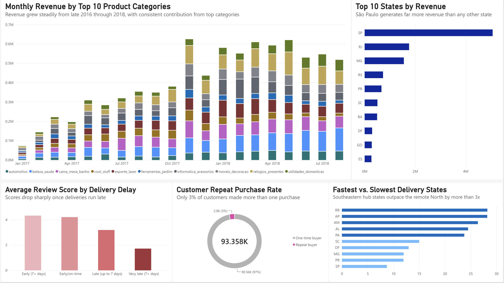

# E-Commerce Analytics Pipeline

An end to end data project built on the Olist Brazilian e-commerce dataset, going from raw CSVs through cleaning, SQL analysis, and an interactive Power BI dashboard.

## Business Questions

1. Which product categories drive the most revenue, and how has that shifted month to month?
2. How does delivery delay affect review scores?
3. What does customer repeat purchase behavior look like?
4. Which states generate the most revenue, and how does delivery speed vary by region?

## Key Findings

- Revenue grew steadily from late 2016 through 2018, with consistent contribution across the top 10 product categories
- Delivery delay strongly predicts satisfaction. Average review score drops from 4.3 stars on early deliveries to 1.7 stars on very late ones
- Repeat purchases are rare. Only 3% of customers placed more than one order, which is a known characteristic of this marketplace rather than a data quality issue
- São Paulo dominates revenue and also has the fastest delivery at 8.7 days on average. The slowest states (RR, AP, AM) take up to 28 days, roughly 3 times longer

## Dashboard

## Tools and Methods

- Data cleaning done in Python (pandas), handling missing values, converting timestamps, and deduplicating records
- SQLite as the database
- SQL for the analysis: multi table joins, aggregate functions, and date arithmetic (see the sql folder)
- Power BI for the dashboard

## Project Structure

- data/processed/query_results holds the aggregated CSV outputs used in Power BI
- notebooks/01_load_data.ipynb loads the raw CSVs into SQLite
- notebooks/02_clean_data.ipynb handles missing values and fixes data types
- notebooks/03_analysis.ipynb runs the analysis queries and exports the results
- sql holds standalone SQL queries for each business question
- dashboard/screenshot_ecommerce_dashboard.png is the dashboard screenshot

## Data Source

[Olist Brazilian E-Commerce Public Dataset](https://www.kaggle.com/datasets/olistbr/brazilian-ecommerce) (Kaggle). Raw CSVs aren't included in this repo. Download them into data/raw to reproduce the project.

## Reproducing This Project

1. Download the dataset into data/raw
2. Run the notebooks in order: 01_load_data.ipynb, then 02_clean_data.ipynb, then 03_analysis.ipynb
3. Import the CSVs from data/processed/query_results into Power BI to rebuild the dashboard